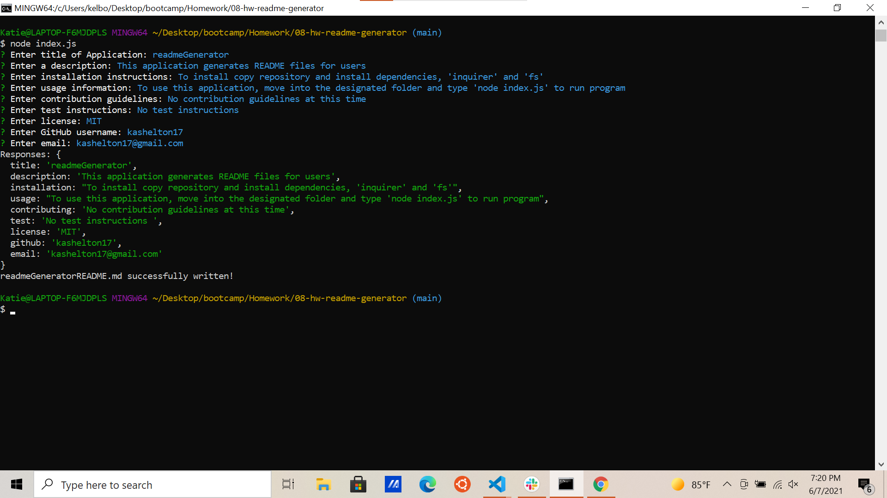
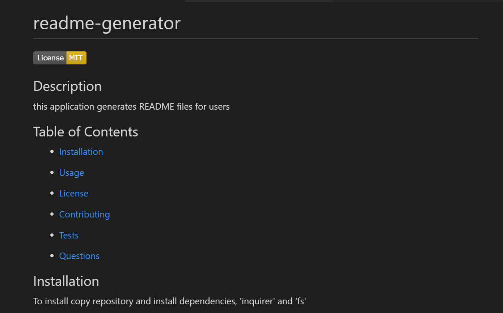

# readmeGenerator 
 

 
 ## Description 
 This application generates professional README.md files for applications including sections for licenses and contact info. Click on preview videos below to see how it works and an example of the resulting readme file.
 
 

 
 ## Table of Contents 

 * [Installation](#installation) 

 * [Usage](#usage) 

 * [License](#license) 

 * [Contributing](#contributing) 

 * [Tests](#Tests) 

 * [Questions](#questions)

 
 ## Installation 
To install download the files along with the dependencies, 'inquirer' and 'fs'

 
 ## Usage 
 To use type 'node index.js' inside the file the application is installed in

 
 ## License 
 This application uses a license from MIT 
  * Link: https://opensource.org/licenses/MIT

 
 ## Contributing 
 No contribution guidelines at this time

 
 ## Tests 
 No test instructions

 
 ## Questions 
 Please find me on GitHub, [github.com/kashelton17](https://github.com/kashelton17), or by email kashelton17@gmail.com for any questions
